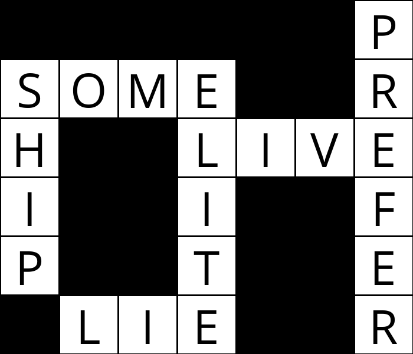

# Crossword Generator
Generates a crossword puzzle by defining a structure and providing a list of words.

## Usage
```
python3 generate.py <path_to_structure>/<structure>.txt <path_to_words>/<words>.txt <output_filename>.png
```
Here is a sample use case:
```
python generate.py sample_data/structure2.txt sample_data/words2.txt out.png
```

## Sample output
